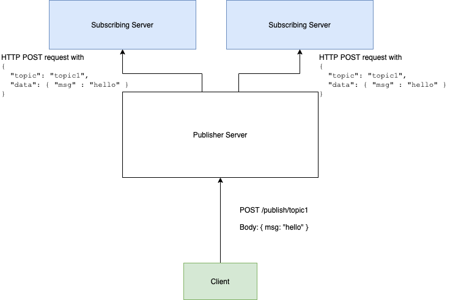

# HTTP Notification System

A simple HTTP notification system

[](https://app.circleci.com/pipelines/github/HazonTechnologies/mlm-software-server)
[](https://github.com/prettier/prettier)

## Brief Description

The HTTP notification system is built following the Publisher-Subscriber Architectural pattern, in which subscriber server(s) can subscribe to receive notifications for a particular topic--- or set or topics---and a client can publish data to said topic via the publisher server. This data would be received by all subscribers that have been subscribed to that particular topic.

The publishing and subscribing functionality is made available via HTTP endpoints.

## Required Architecture



## Getting Started

These instructions will get you a copy of the project up and running on your local machine for testing purposes.

### Prerequisites

System requirements for this project to work includes:

- Node.js(v8 or higher)
- Node Package Manager (NPM)

### Installation

To install the dependencies in the package.json file, run the following command:

```bash
npm install
```

### Running the project

To run the project on your local machine, navigate to the project directory and run the following commands on separate terminals

```bash
npm run start:publisher
npm run start:subscriber
```

### Unit testing

Run the following command

```bash
npm test
```

### Environmental Variables

The `publisher.js` file runs on a default port of `8000`, while the `subscriber.js` file runs on a default port of `9000`. However, if you wish to use different port values, create a `.env` file in the root directory of the project, with variable names as specified in the `env.sample` file provided.

## Built With

- [Express](https://expressjs.com/) - The Node.js web framework used
- [NPM](https://www.npmjs.com/) - Dependency Manager for Node.js
